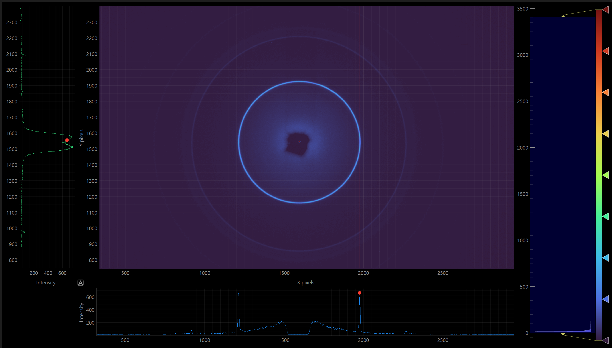

# OSC Reader and Diffraction Toolkit



`OSC_Reader` is a lightweight toolkit for working with Rigaku RAXIS `.osc`
images.  It now bundles the diffraction utilities from the former
`DVB_pack` project, providing a single, streamlined package for loading raw
detector frames, visual exploration, azimuthal integration and peak
fitting.

---

## Features

- **Read `.osc` files** directly into memory for further processing.
- **Convert to ASCII grid files (`.asc`)** for numerical analysis.
- **Convert to JPEG images** for easy sharing or documentation.
- **Interactive viewer** with cross‑hair inspection, pixel intensity
  readouts, adjustable intensity scaling, high-FPS rendering, and direct
  detector-to-`φ`/`2θ` conversion from user-supplied geometry.
- **Exact detector-to-angle-space conversion** with a portable
  detector-distance and beam-center geometry model.
- **Parallel angle-space processing** using a 24-worker conversion path
  whenever the detector-to-`φ`/`2θ` transform is used.
- **Diffraction utilities** (`OSC_Reader.tools`) for azimuthal integration,
  reciprocal space plotting and detector corrections.
- **Peak analysis helpers** (`OSC_Reader.peak_analysis`) for fitting and
  analysing pseudo-Voigt peaks.

## Installation

```bash
pip install .
```

This installs the core `OSC_Reader` package with dependencies for the
interactive high-FPS viewer and the numba-backed detector-to-angle-space
converter. The broader diffraction and peak-analysis utilities still rely on
additional scientific packages such as `matplotlib`, `pandas`, `pyFAI`,
`fabio`, `scipy`, and `lmfit`. Install them with your preferred package
manager when you need those features.

## Quick Start

### Read a file

```python
from OSC_Reader import read_osc

data = read_osc("example.osc")
print(data.shape)
```

### Convert to an ASCII grid

```python
from OSC_Reader import convert_to_asc

convert_to_asc("example.osc")  # creates example.asc
```

### Convert to a JPEG image

```python
from OSC_Reader import osc2jpg

osc2jpg("example.osc")  # creates example.jpg
```

### Visualize interactively

Run the viewer as a script to explore pixel values and cross sections:

```bash
python -m OSC_Reader.OSC_Viewer path/to/example.osc
```

or launch without a path to pick a file in a GUI dialog:

```bash
python -m OSC_Reader.OSC_Viewer
```

Viewer controls:
- Move mouse over image: update crosshair and side/bottom profiles
- Left-click + drag: zoom to region
- `Reset Zoom`: return to full frame
- `Save Image`: export current rendered image view
- `Pick Beam Center`: click the detector image to place the beam center
- `Distance`, `Pixel Size`, `2θ Bins`, `φ Bins`: set geometry/input values for conversion
- `Convert to φ/2θ`: convert the currently loaded detector image using the 24-worker angle-space pipeline
- `Show Detector`: switch back from the converted `φ`/`2θ` view to the raw detector image
- `Bottom Log Y`: toggle log scale for bottom profile intensity axis
- `Side Log X`: toggle log scale for side profile intensity axis

Recommended detector-to-`φ`/`2θ` workflow in the GUI:
1. Open an `.osc` image.
2. Click `Pick Beam Center`, then click the direct-beam position on the detector image.
3. Enter the sample-to-detector `Distance` and detector `Pixel Size` in millimetres.
4. Adjust `2θ Bins` and `φ Bins` to control the output map resolution.
5. Click `Convert to φ/2θ` to transform the active detector frame.
6. Use `Show Detector` to return to the raw detector view without reloading the file.

Geometry inputs used by the viewer:

| Input | Meaning |
|----------|-------------|
| `Center X` | Beam-center column on the detector image, in pixels |
| `Center Y` | Beam-center row on the detector image, in pixels |
| `Distance` | Sample-to-detector distance in millimetres |
| `Pixel Size` | Detector pixel pitch in millimetres |
| `2θ Bins` | Number of radial bins in the output angle-space image |
| `φ Bins` | Number of azimuthal bins in the output angle-space image |

The viewer runs this conversion in a background worker so the UI remains
responsive while the transform is computed.

Windows users can also launch with the included batch file:

```bat
Run_OSC_Viewer.bat
```

You can drag and drop an `.osc` file onto `Run_OSC_Viewer.bat` to open that file directly.

To set this viewer as the default app for `.osc` files (current user), run:

```bat
Register_OSC_Default_App.bat
```

or call it directly from Python:

```python
from OSC_Reader import visualize_osc_data

visualize_osc_data("example.osc")
```

### Convert a detector image to `φ`/`2θ` space from Python

```python
from OSC_Reader import (
    convert_image_to_phi_2theta_space,
    prepare_gui_phi_display,
    read_osc,
)

image = read_osc("example.osc")

result = convert_image_to_phi_2theta_space(
    image,
    distance_mm=75.0,
    pixel_size_mm=0.1,
    center_row_px=1500.0,
    center_col_px=1500.0,
    radial_bins=1000,
    azimuth_bins=720,
)

cake_image, two_theta_deg, phi_deg = prepare_gui_phi_display(result)
print(cake_image.shape)
```

The conversion wrapper accepts the same geometry values exposed by the GUI and
returns a `DetectorCakeResult` containing:

- `radial_deg`: the `2θ` bin centers in degrees
- `azimuthal_deg`: the raw azimuthal bin centers in degrees
- `intensity`: the converted detector image in angle space
- `sum_signal`, `sum_normalization`, `count`: accumulation arrays from the exact splitter

By default, `convert_image_to_phi_2theta_space(...)` uses the numba-backed
engine and a fixed 24-worker path. This is intended for large detector images
where serial rebinnig would be too slow for interactive use.

If you need additional control over the output map, the conversion API also
accepts:

| Argument | Description | Default |
|----------|-------------|---------|
| `two_theta_min_deg` | Lower `2θ` limit of the output map | `0.0` |
| `two_theta_max_deg` | Upper `2θ` limit of the output map | `90.0` |
| `phi_min_deg` | Lower azimuthal limit of the output map | `-180.0` |
| `phi_max_deg` | Upper azimuthal limit of the output map | `180.0` |
| `correct_solid_angle` | Apply flat-detector solid-angle normalization | `False` |
| `engine` | Conversion backend (`"numba"` or `"python"`) | `"numba"` |
| `workers` | Worker count for the parallel conversion path | `24` |

### Use the diffraction utilities

```python
from OSC_Reader import (
    setup_azimuthal_integrator,
    display,
    integrate_spec,
    plot_qz_vs_qr,
)

ai = setup_azimuthal_integrator("calibration.poni")
data = display("sample.osc", ai, show=False)
spec = integrate_spec(data, d=0.3, c=(1500, 1500), th_range=(5, 50), phi_range=(-90, 90))
plot_qz_vs_qr(spec)
```

### Peak analysis

```python
from OSC_Reader import fit_pvoigt_peaks, process_data

results = process_data(ai, data, regions=[[7, 12, -20, 20, "003"]])
fits = fit_pvoigt_peaks(results)
```

## Contributing

Pull requests and issue reports are welcome.  If you have an idea or find
 a bug, please open an issue so we can discuss it.

## License

Released under the GPL‑3.0 License.  See the [LICENSE](LICENSE) file for
details.

## Contact

David Beckwitt – david.beckwitt@gmail.com

